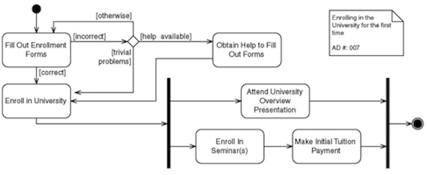

# Specification Phase Exercise

A little exercise to get started with the specification phase of the software development lifecycle. See the [instructions](instructions.md) for more detail.

## Team members

See instructions. Delete this line and replace with a list of the names of your team members, including links to each one's GitHub profile.  
[Jack Wang](https://github.com/JackInTheBox314), 
team member, 
team member, 
[Jonathan Gao](https://github.com/jg169)

## Stakeholders

See instructions. Delete this line and replace with the name(s) of the stakeholder(s) you interviewed and lists showing their goals/needs, and problems/frustrations.

### Stakeholder 1: Shemar Forbes 

Goals/needs: 
- hope to have a good professor 
- needs to be a good class fit 
- likes classes with groups 
- lean more towards group work itself for meeting new people 
- it would be nice to have people that you know 
- get into a class that works for the schedule, but instead of a number one choice he is searching for a second or third choice 
- searching for second or third choice ruins the experience for him 

Problems/frustrations: 
- Albert itself should have a split screen view 
- more student centric 
- not realizing how many classes you may have is an issue 
- filled up classes 
- inconveninet times for classes 
- more clarity regarding being on the waitlist 
- there is a cap on the waitlist 
- the current system doesn't do much to help those on the waitlist 
- advisors aren't very helpful 
- feels like a waste of money
- wanting some satisfaction from the course selections 

### Stakeholder 2: 

Goals/needs: 

Problems/frustrations: 

### Stakeholder 3: 

Goals/needs: 

Problems/frustrations: 

## Product Vision Statement

See instructions. Delete this line and place your Product Vision Statement here.

ClassBay (like ebay but for classes) is a service that revamps class signups and waitlists with a secondary marketplace for course registration, providing course liquidity by allowing students to exchange spots during the add-drop period making a stressful process streamlined and leading to better matchups through social dynamics and free market principles. 

## User Requirements

See instructions. Delete this line and place a list of your User Stories here.

As a student that is graduating soon, I am looking for a class that can prepare me for the workforce so that I feel ready. 

As a customer, I want to sign up so I can start placing orders.

1. As a college student graduating soon, I want get into a class that is practical so that I can be prepared for the workforce. 
2. As a college student looking into classes, I want to switch to classes that fit my needs so that I can take classes that are more balanced to handle the semester. 
3. As a college student looking into signing up for classes, I want to sign up for classes with some people that I am familiar with so that I feel that I know some people in class and projects.

## Activity Diagrams

See instructions. Delete this line and place images of your UML Activity diagrams here.  
Example UML Activity Diagram:  

## Clickable Prototype

See instructions. Delete this line and place a publicly-accessible link to your clickable prototype here.  

[prototype link](https://www.figma.com/proto/snzrok5nuP927l1r6CneUJ/TheBestTeam?node-id=1-2&p=f&t=0Sxey6lYgSSU1JSI-1&scaling=scale-down&content-scaling=fixed&page-id=0%3A1&starting-point-node-id=1%3A2)
